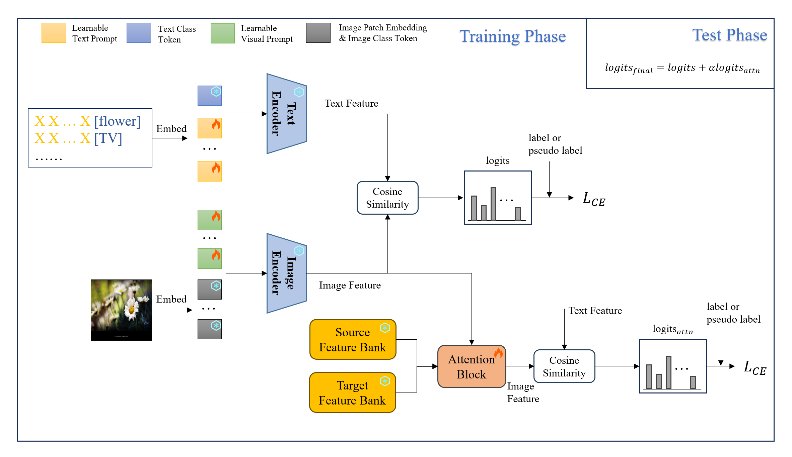

# Attention-based-Prompt-Tuning for Unsupervised Domain Adaptation


> [**Attention-based-Prompt-Tuning for Unsupervised Domain Adaptation**](arXiv网址)<br>
> [作者名](作者网页),


Official implementation of the paper "[Attention-based-Prompt-Tuning for Unsupervised Domain Adaptation](arXiv网站)".
<hr />

## Highlights


> **<p align="justify"> Abstract:** *Unsupervised domain adaptation (UDA) aims to learn a generalizable model using labeled data from a source domain and unlabeled data from a target domain. Conventional UDA methods mainly focus on aligning divergences and utilizing adversarial learning to learn domain-invariant features. 
Inspired by the powerful zero-shot inference ability of the pre-trained visual-language foundation model such as CLIP, we empirically demonstrate that zero-shot CLIP and prompt-tuning CLIP exhibit outstanding generalization performance on the UDA problem. 
Based on this insight, in this work, we propose an \textbf{a}ttention-based \textbf{p}rompt \textbf{t}uning (\textbf{APT}) method that enhances the generalization ability of prompt tuning methods for UDA. 
Specifically, we utilize zero-shot CLIP to generate pseudo labels, which are used to construct a source-domain and target-domain feature bank to get attention pairs. Then the attention block explores cross-domain informative features to embed into the prompt and model.
We conduct extensive experiments on three commonly used domain adaptation benchmarks, namely Office-Home, Office-31 and VisDA-2017, and demonstrate that APT achieves state-of-the-art performance.* </p>

## Main Contributions

1) We propose a two-branch \textbf{a}ttention-based \textbf{p}rompt \textbf{t}uning (\textbf{APT}) method. APT takes advantage of prompt learning and attention mechanism, and thus explores more domain-invariant features with much fewer parameters.
2) With the benefit of the powerful zero-shot inference ability of CLIP, we design a self-attention and cross-attention mechanism that is suitable for prompt-tuning CLIP methods, which allows the model and the prompt to better adapt to the target domain. 
3) We conduct an empirical experiment to verify the effectiveness of applying zero-shot CLIP and prompt-tuning CLIP for UDA. Moreover, extensive experiments on Office-Home, Office-31 and Visda-2017 datasets demonstrate that our proposed APT method has achieved state-of-the-art performance by comparing the prompt-tuning methods and a series of UDA methods.

<hr />

## Results
### APT in comparison with existing prompt tuning methods
Results reported below show accuracy across 3 UDA datasets. Our APT method adopts the paradigm of MaPLe.

| Name                                                      | Office-Home Acc. | Office-31 Acc. |  VisDA-2017 Acc.  | 
|-----------------------------------------------------------|:---------:|:----------:|:---------:|
| [CLIP](https://arxiv.org/abs/2103.00020)                  |   82.1   |   77.5    |   88.9   | 
| [CoOp](https://arxiv.org/abs/2109.01134)                  |   83.9   |   89.4    |   82.7   |
| [CoCoOp](https://arxiv.org/abs/2203.05557)                |   84.1   |   88.9    |   84.2   | 
| [VPT*](https://arxiv.org/abs/2203.17274)                  |   81.7   |   77.4    |   88.7   | 
| [VPT-deep](https://arxiv.org/abs/2203.17274)              |   83.9   |   89.4    |   86.2   | 
| [MaPLe](https://arxiv.org/abs/2210.03117)                 |   84.2   |   89.6    |   83.5   |
| [DAPL](https://arxiv.org/abs/2202.06687)                  |   84.4   |   81.2    |   89.5   |
| [APT](网址)                                               |   **85.7**   |   **91.2**    | **78.55** | 

## Installation 
For installation and other package requirements, please follow the instructions as follows. 
This codebase is tested on Ubuntu 18.04 LTS with python 3.7. Follow the below steps to create environment and install dependencies.

* Setup conda environment.
```bash
# Create a conda environment
conda create -y -n apt python=3.7

# Activate the environment
conda activate apt

# Install torch (requires version >= 1.8.1) and torchvision
# Please refer to https://pytorch.org/get-started/previous-versions/ if your cuda version is different
conda install pytorch==1.12.0 torchvision==0.13.0 torchaudio==0.12.0 cudatoolkit=11.3 -c pytorch
```

* Install dassl library.
```bash
# Instructions borrowed from https://github.com/KaiyangZhou/Dassl.pytorch#installation

# Clone this repo
git clone https://github.com/KaiyangZhou/Dassl.pytorch.git
cd Dassl.pytorch/

# Install dependencies
pip install -r requirements.txt

# Install this library (no need to re-build if the source code is modified)
python setup.py develop
cd ..
```

* Clone APT code repository and install requirements
```bash
# Clone APT code base
https://github.com/BaiShuanghao/Attention-based-Prompt-Tuning.git

cd Attention-based-Prompt-Tuning/

# Install requirements
pip install -r requirements.txt
'''

## Data preparation
Please follow the instructions as follows to prepare all datasets.
Datasets list:
- [Office-Home](https://drive.google.com/file/d/0B81rNlvomiwed0V1YUxQdC1uOTg/view?pli=1&resourcekey=0-2SNWq0CDAuWOBRRBL7ZZsw)
- [Office-31](https://faculty.cc.gatech.edu/~judy/domainadapt/#datasets_code)
- [VisDA-2017](http://ai.bu.edu/visda-2017/#download)

<hr />


## Training and Evaluation
Please follow the instructions as follows for training, evaluating and reproducing the results.


<hr />

## Citation
If you use our work, please consider citing:
```bibtex
bibtex
```


## Acknowledgements

Our code is based on [CoOp and CoCoOp](https://github.com/KaiyangZhou/CoOp), [DAPL](https://github.com/LeapLabTHU/DAPrompt/tree/main) and [MaPLe](https://github.com/muzairkhattak/multimodal-prompt-learning) repository. We thank the authors for releasing their code. If you use our model and code, please consider citing these works as well.
Supported methods are as follows:

| Method                    | Paper                                         |                             Code                            |  
|---------------------------|:----------------------------------------------:|:---------------------------------------------------------------:|
| CoOp                      | [IJCV 2022](https://arxiv.org/abs/2109.01134) |  [link](https://github.com/KaiyangZhou/CoOp)                  |
| CoCoOp                    | [CVPR 2022](https://arxiv.org/abs/2203.05557) |                 [link](configs/trainers/CoCoOp)                 |
| IVLP                      | [CVPR 2023](https://arxiv.org/abs/2210.03117) | [link](configs/trainers/MaPLe/vit_b16_c2_ep5_batch4_2ctx.yaml)  |
| MaPLe                     | [CVPR 2023](https://arxiv.org/abs/2210.03117) | [link](configs/trainers/MaPLe/vit_b16_c2_ep5_batch4_2ctx.yaml)  |
| DAPL                      | [-](https://arxiv.org/abs/2202.06687)       | [link](https://github.com/LeapLabTHU/DAPrompt)  |
