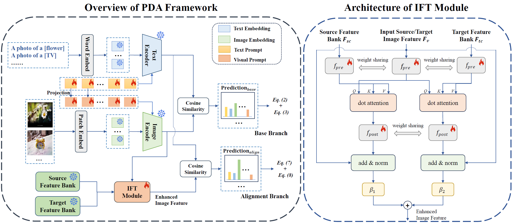

# Prompt-based Distribution Alignment [[AAAI 2024](https://ojs.aaai.org/index.php/AAAI/article/view/27830)]

Official implementation of the paper "[Prompt-based Distribution Alignment for Unsupervised Domain Adaptation](https://arxiv.org/abs/2312.09553v2)".
<hr />

## Highlights


> **<p align="justify"> Abstract:** *Recently, despite the unprecedented success of large pre-trained visual-language models (VLMs) on a wide range of downstream tasks, the real-world unsupervised domain adaptation (UDA) problem is still not well explored.
Therefore, in this paper, we first experimentally demonstrate that the unsupervised-trained VLMs can significantly reduce the distribution discrepancy between source and target domains, thereby improving the performance of UDA. 
However, a major challenge for directly deploying such models on downstream UDA tasks is prompt engineering, which requires aligning the domain knowledge of source and target domains, since the performance of UDA is severely influenced by a good domain-invariant representation.
We further propose a Prompt-based Distribution Alignment (PDA) method to incorporate the domain knowledge into prompt learning. Specifically, PDA employs a two-branch prompt-tuning paradigm, namely base branch and alignment branch.
The base branch focuses on integrating class-related representation into prompts, ensuring discrimination among different classes. 
To further minimize domain discrepancy, for the alignment branch, we construct feature banks for both the source and target domains and propose image-guided feature tuning (IFT) to make the input attend to feature banks, which effectively integrates self-enhanced and cross-domain features into the model. 
In this way, these two branches can be mutually promoted to enhance the adaptation of VLMs for UDA.
We conduct extensive experiments on three benchmarks to demonstrate that our proposed PDA achieves state-of-the-art performance.* </p>

## Main Contributions

1) We first experimentally verify the effectiveness of VLM on UDA downstream tasks. Then, based on this finding, we further propose a prompt-based distribution alignment (PDA) method to tune prompt to the target domain.
2) The proposed PDA includes two training branches. First, the base branch ensures discrimination among different classes. Second, the aligned branch obtains the domain-invariant information by image-guided feature tuning.
3) Extensive experiments demonstrate the effectiveness of the proposed PDA, which achieves state-of-the-art performance on Office-Home, Office-31 and VisDA-2017.

<hr />

## Results
### PDA in comparison with existing prompt tuning methods
Results reported below show accuracy across 3 UDA datasets with ViT-B/16 backbone. Our PDA method adopts the paradigm of multi-modal prompt tuning.

| Name                                                      | Office-Home Acc. | Office-31 Acc. |  VisDA-2017 Acc.  | 
|-----------------------------------------------------------|:---------:|:----------:|:---------:|
| [CLIP](https://arxiv.org/abs/2103.00020)                  |   82.1   |   77.5    |   88.9   | 
| [CoOp](https://arxiv.org/abs/2109.01134)                  |   83.9   |   89.4    |   82.7   |
| [CoCoOp](https://arxiv.org/abs/2203.05557)                |   84.1   |   88.9    |   84.2   | 
| [VP](https://arxiv.org/abs/2203.17274)                    |   81.7   |   77.4    |   88.7   | 
| [VPT-deep](https://arxiv.org/abs/2203.17274)              |   83.9   |   89.4    |   86.2   | 
| [MaPLe](https://arxiv.org/abs/2210.03117)                 |   84.2   |   89.6    |   83.5   |
| [DAPL](https://arxiv.org/abs/2202.06687)                  |   84.4   |   81.2    |   89.5   |
| [PDA](https://arxiv.org/abs/2312.09553)(Ours)             |   **85.7**   |   **91.2**    | **89.7** | 

## Installation 
For installation and other package requirements, please follow the instructions as follows. 
This codebase is tested on Ubuntu 18.04 LTS with python 3.7. Follow the below steps to create environment and install dependencies.

* Setup conda environment.
```bash
# Create a conda environment
conda create -y -n pda python=3.7

# Activate the environment
conda activate pda

# Install torch (requires version >= 1.8.1) and torchvision
# Please refer to https://pytorch.org/get-started/previous-versions/ if your cuda version is different
conda install pytorch==1.12.0 torchvision==0.13.0 torchaudio==0.12.0 cudatoolkit=11.3 -c pytorch
```

* Install dassl library.
```bash
# Instructions borrowed from https://github.com/KaiyangZhou/Dassl.pytorch#installation

# Clone this repo
git clone https://github.com/KaiyangZhou/Dassl.pytorch.git
cd Dassl.pytorch

# Install dependencies
pip install -r requirements.txt

# Install this library (no need to re-build if the source code is modified)
python setup.py develop
cd ..
```

* Clone PDA code repository and install requirements.
```bash
# Clone PDA code base
git clone https://github.com/BaiShuanghao/Prompt-based-Distribution-Alignment.git
cd Prompt-based-Distribution-Alignment

# Install requirements
pip install -r requirements.txt
```

## Data preparation
Please follow the instructions as follows to prepare all datasets.
Datasets list:
- [Office-Home](https://drive.google.com/file/d/0B81rNlvomiwed0V1YUxQdC1uOTg/view?pli=1&resourcekey=0-2SNWq0CDAuWOBRRBL7ZZsw)
- [Office-31](https://faculty.cc.gatech.edu/~judy/domainadapt/#datasets_code)
- [VisDA-2017](http://ai.bu.edu/visda-2017/#download)

<hr />


## Training and Evaluation
Please follow the instructions for training, evaluating and reproducing the results.
Firstly, you need to **modify the directory of data by yourself**.
### Training 
```bash
# Example: trains on Office-Home dataset, and the source domian is art and the target domain is clipart (a-c)
bash scripts/pda/main_pda.sh officehome b32_ep10_officehome PDA ViT-B/16 2 a-c 0
```

### Evaluation
```bash
# evaluates on Office-Home dataset, and the source domian is art and the target domain is clipart (a-c)
bash scripts/pda/eval_pda.sh officehome b32_ep10_officehome PDA ViT-B/16 2 a-c 0
```
The details are at each method folder in [scripts folder](scripts/).
<hr />

## Citation
If you use our work, please consider citing:
```bibtex
@inproceedings{bai2024prompt,
  title={Prompt-based distribution alignment for unsupervised domain adaptation},
  author={Bai, Shuanghao and Zhang, Min and Zhou, Wanqi and Huang, Siteng and Luan, Zhirong and Wang, Donglin and Chen, Badong},
  booktitle={Proceedings of the AAAI Conference on Artificial Intelligence},
  volume={38},
  number={2},
  pages={729--737},
  year={2024}
}
```


## Acknowledgements

Our style of reademe refers to [MaPLe](https://github.com/muzairkhattak/multimodal-prompt-learning). 
And our code is based on [CoOp and CoCoOp](https://github.com/KaiyangZhou/CoOp), [DAPL](https://github.com/LeapLabTHU/DAPrompt/tree/main) and [MaPLe](https://github.com/muzairkhattak/multimodal-prompt-learning) etc. repository. We thank the authors for releasing their code. If you use their model and code, please consider citing these works as well.
Supported methods are as follows:

| Method                    | Paper                                         |                             Code                            |  
|---------------------------|:----------------------------------------------:|:---------------------------------------------------------------:|
| CoOp                      | [IJCV 2022](https://arxiv.org/abs/2109.01134) |  [link](https://github.com/KaiyangZhou/CoOp)                         |
| CoCoOp                    | [CVPR 2022](https://arxiv.org/abs/2203.05557) |  [link](https://github.com/KaiyangZhou/CoOp)                         |
| VP                        | [-](https://arxiv.org/abs/2203.17274)         |  [link](https://github.com/hjbahng/visual_prompting)                 |
| VPT                       | [ECCV 2022](https://arxiv.org/abs/2203.17274) |  [link](https://github.com/KMnP/vpt)                                 |
| IVLP & MaPLe              | [CVPR 2023](https://arxiv.org/abs/2210.03117) |  [link](https://github.com/muzairkhattak/multimodal-prompt-learning) |
| DAPL                      | [TNNLS 2023](https://arxiv.org/abs/2202.06687)     |  [link](https://github.com/LeapLabTHU/DAPrompt)                      |
